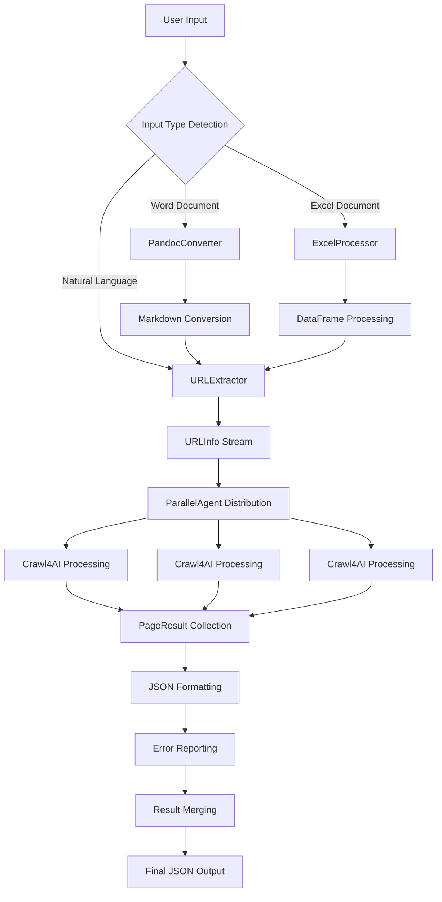

# Web Content Extractor Agent - Detailed Design Document

## 1. Project Overview

### 1.1 Integration with Mindora ADK Agents Platform
The Web Content Extractor Agent is designed as an integrated module within the **Mindora ADK Agents** platform, following the established patterns of the existing intelligent agent ecosystem.

**Platform Architecture Integration:**
- **Platform Type**: Custom Agent (app_type: "custom")  
- **Base Framework**: Google ADK 1.9.0+ with FastAPI backend
- **Frontend Integration**: Angular 19 with ADK Web components
- **Communication**: WebSocket + SSE streaming for real-time progress

### 1.2 Agent Architecture Type
The Web Content Extractor Agent employs Google ADK's **Sequential Workflow architecture** optimized for the platform's multi-agent ecosystem.

**Primary Architecture Pattern:** Input Processing → Web Crawling → Output Formatting
- **Single ADK Agent**: Streamlined implementation using tools and sequential processing
- **Tool-based Architecture**: Leveraging ADK function tools for modular functionality
- **Event-driven Feedback**: Real-time progress updates through platform's SSE system

### 1.3 Core Capabilities
- **Multi-format Input Processing**: Natural language, Word (.docx), Excel (.xlsx)
- **Intelligent Web Content Extraction**: Using crawl4ai with platform optimization
- **Real-time Progress Feedback**: Platform-integrated SSE streaming
- **Multi-turn Conversation Support**: Platform session management
- **Structured JSON Output**: Platform-standardized result formatting

## 2. Directory Structure Design (Platform Integration)

```
backend/agents/web_content_extractor/
├── agent.py                    # Main ADK agent definition (follows platform pattern)
├── config.json                 # Agent configuration (platform standard)
├── __init__.py                 # Package initialization
├── tools/
│   ├── __init__.py
│   ├── document_processor.py   # Document parsing and URL extraction
│   ├── web_crawler.py          # Web scraping with crawl4ai integration
│   └── content_formatter.py    # Result formatting and output generation
├── schemas.py                  # Data models and type definitions
├── utils.py                    # Utility functions and helpers
├── docs/
│   ├── web_scraper_design_doc.md
│   ├── detailed_design.md
│   └── plan.md
└── tests/
    ├── __init__.py
    ├── test_agent.py           # Main agent tests
    ├── test_tools.py           # Tools unit tests
    └── test_integration.py     # Platform integration tests
```

**Key Changes from Original Design:**
- **No separate requirements.txt**: Dependencies managed at platform level
- **Simplified structure**: Following platform's agent pattern (assistant, data_analyst)
- **Platform-standard files**: config.json, __init__.py following established patterns
- **Consolidated tools**: Fewer, more focused tool modules

## 3. Core Module Code Frameworks

### 3.1 Main Agent Definition (`agent.py`)

```python
"""
Agent: 智能网页信息整理
Description: 基于Google ADK的智能网页内容提取和整理系统，支持多种输入格式
"""

from typing import Dict, Any, List
from google.adk.agents import Agent
import asyncio
import re

from .tools.document_processor import (
    process_word_document,
    process_excel_document,
    extract_urls_from_text
)
from .tools.web_crawler import (
    crawl_single_url,
    crawl_multiple_urls
)
from .tools.content_formatter import (
    format_extraction_results,
    generate_statistics_report
)
from .schemas import URLInfo, ExtractionResult
from .utils import validate_url, categorize_error

def extract_urls_from_input(content: str, source: str = "user_input") -> List[Dict[str, Any]]:
    """
    从用户输入中提取URL信息
    
    Args:
        content: 输入内容（文本、文档路径等）
        source: 输入来源标识
    
    Returns:
        List[Dict]: URL信息列表
    """
    try:
        # 检测输入类型并处理
        if content.lower().endswith(('.docx', '.doc')):
            # Word文档处理
            urls = process_word_document(content)
        elif content.lower().endswith(('.xlsx', '.xls')):
            # Excel文档处理  
            urls = process_excel_document(content)
        else:
            # 普通文本中提取URL
            urls = extract_urls_from_text(content)
        
        return {
            "status": "success",
            "urls_found": len(urls),
            "urls": urls,
            "source": source
        }
    except Exception as e:
        return {
            "status": "error",
            "error_message": f"输入处理失败: {str(e)}",
            "urls": []
        }

def extract_web_content(urls_data: Dict[str, Any]) -> Dict[str, Any]:
    """
    提取网页内容
    
    Args:
        urls_data: URL数据字典
    
    Returns:
        Dict: 提取结果
    """
    try:
        if not urls_data.get("urls"):
            return {
                "status": "error", 
                "error_message": "没有找到有效的URL",
                "results": []
            }
        
        # 使用异步爬虫提取内容
        results = crawl_multiple_urls(urls_data["urls"])
        
        return {
            "status": "success",
            "total_processed": len(urls_data["urls"]),
            "successful_extractions": len([r for r in results if r["status"] == "success"]),
            "results": results
        }
    except Exception as e:
        return {
            "status": "error",
            "error_message": f"网页内容提取失败: {str(e)}",
            "results": []
        }

def format_final_output(extraction_data: Dict[str, Any]) -> Dict[str, Any]:
    """
    格式化最终输出结果
    
    Args:
        extraction_data: 提取数据
    
    Returns:
        Dict: 格式化的最终结果
    """
    try:
        # 使用内容格式化工具生成最终JSON
        formatted_result = format_extraction_results(extraction_data)
        
        # 添加统计报告
        stats = generate_statistics_report(extraction_data.get("results", []))
        formatted_result["statistics"] = stats
        
        return formatted_result
    except Exception as e:
        return {
            "status": "error",
            "error_message": f"结果格式化失败: {str(e)}",
            "results": []
        }

# 创建基于ADK的网页内容提取Agent
root_agent = Agent(
    name="web_content_extractor",
    model="gemini-2.0-flash-exp",
    description="智能网页信息整理系统，支持多种输入格式的URL提取和网页内容抓取",
    instruction="""你是一个专业的网页信息整理助手，可以帮助用户从各种输入中提取网页内容。

你的主要能力包括：
1. **输入处理**: 支持自然语言文本、Word文档(.docx)、Excel文档(.xlsx)
2. **URL提取**: 智能识别和提取各种格式的网页链接
3. **内容抓取**: 并行处理多个URL，提取网页标题和正文内容
4. **格式输出**: 生成结构化JSON结果，包含统计信息和错误报告
5. **进度反馈**: 实时显示处理进度和状态

工作流程：
1. 首先使用 extract_urls_from_input 工具从用户输入中提取URL
2. 然后使用 extract_web_content 工具并行抓取网页内容  
3. 最后使用 format_final_output 工具格式化输出结果

请始终：
- 提供清晰的处理进度反馈
- 对错误进行友好的解释
- 生成完整的统计信息
- 保持结果格式的一致性

支持的输入示例：
- 直接粘贴包含URL的文本
- 上传包含链接的Word或Excel文件
- 多轮对话中追加新的URL""",
    tools=[
        extract_urls_from_input, 
        extract_web_content, 
        format_final_output
    ],
)
```

### 3.2 Data Schemas (`shared/schemas.py`)

```python
"""
Shared data models for the Web Content Extractor Agent
Defines standardized data structures for inter-agent communication
"""

from typing import Optional, List, Dict, Any, Literal
from dataclasses import dataclass, field
from datetime import datetime
from enum import Enum

class ProcessingStatus(Enum):
    """Enumeration of processing states"""
    PENDING = "pending"
    IN_PROGRESS = "in_progress"
    SUCCESS = "success"
    ERROR = "error"

class InputType(Enum):
    """Supported input format types"""
    NATURAL_LANGUAGE = "natural_language"
    WORD_DOCUMENT = "word_document"
    EXCEL_DOCUMENT = "excel_document"

@dataclass
class URLInfo:
    """
    Structured representation of extracted URL information
    Passed from InputProcessorAgent to WebCrawlerAgent
    """
    url: str
    source: str  # Source file name or "natural_language_input"
    metadata: Optional[Dict[str, Any]] = field(default_factory=dict)
    extraction_context: Optional[str] = None  # Surrounding text context
    
    def __post_init__(self):
        """Validate URL format after initialization"""
        if not self.url.startswith(('http://', 'https://')):
            if not self.url.startswith('www.'):
                self.url = f"https://{self.url}"
            else:
                self.url = f"https://{self.url}"

@dataclass
class PageResult:
    """
    Structured representation of web page extraction results
    Passed from WebCrawlerAgent to OutputFormatterAgent
    """
    url_info: URLInfo
    title: Optional[str] = None
    content: Optional[str] = None  # Markdown formatted content
    status: ProcessingStatus = ProcessingStatus.PENDING
    error_msg: Optional[str] = None
    word_count: Optional[int] = None
    processing_time_ms: Optional[int] = None
    timestamp: datetime = field(default_factory=datetime.now)
    
    def __post_init__(self):
        """Calculate word count if content is available"""
        if self.content and self.word_count is None:
            self.word_count = len(self.content.split())

@dataclass
class ProcessingSession:
    """
    Session state management for multi-turn conversations
    Maintains conversation context and history
    """
    session_id: str
    conversation_turn: int = 1
    total_urls_processed: int = 0
    successful_extractions: int = 0
    failed_extractions: int = 0
    historical_results: List[PageResult] = field(default_factory=list)
    
    def add_results(self, results: List[PageResult]):
        """Add new results to session history"""
        self.historical_results.extend(results)
        self.total_urls_processed += len(results)
        self.successful_extractions += len([r for r in results if r.status == ProcessingStatus.SUCCESS])
        self.failed_extractions += len([r for r in results if r.status == ProcessingStatus.ERROR])

@dataclass
class FinalOutput:
    """
    Final structured JSON output format
    Comprehensive result with statistics and error reporting
    """
    timestamp: datetime = field(default_factory=datetime.now)
    source: str = "unknown"
    input_type: InputType = InputType.NATURAL_LANGUAGE
    session_info: Optional[ProcessingSession] = None
    
    # Processing Statistics
    total_urls: int = 0
    successful_count: int = 0
    failed_count: int = 0
    success_rate: float = 0.0
    total_processing_time_ms: int = 0
    average_processing_time_ms: float = 0.0
    
    # Results and Errors
    results: List[PageResult] = field(default_factory=list)
    errors: List[Dict[str, Any]] = field(default_factory=list)
    
    # Content Statistics
    total_words_extracted: int = 0
    average_words_per_page: float = 0.0
    
    def calculate_statistics(self):
        """Calculate derived statistics after results are populated"""
        if self.total_urls > 0:
            self.success_rate = self.successful_count / self.total_urls * 100
        
        if self.successful_count > 0:
            total_processing_time = sum(
                r.processing_time_ms or 0 
                for r in self.results 
                if r.status == ProcessingStatus.SUCCESS
            )
            self.total_processing_time_ms = total_processing_time
            self.average_processing_time_ms = total_processing_time / self.successful_count
            
            self.total_words_extracted = sum(
                r.word_count or 0 
                for r in self.results 
                if r.status == ProcessingStatus.SUCCESS
            )
            self.average_words_per_page = self.total_words_extracted / self.successful_count
```

### 3.3 Web Crawler Tools (`tools/web_crawler.py`)

```python
"""
Web content extraction tools using crawl4ai integration
Implements intelligent web scraping with progress reporting
"""

import asyncio
from typing import List, Optional, Dict, Any
from datetime import datetime
import time

from crawl4ai import AsyncWebCrawler
from adk.events import send_event
from shared.schemas import URLInfo, PageResult, ProcessingStatus
from shared.config import CRAWLER_CONFIG

class Crawl4AIWrapper:
    """
    Intelligent web content extraction using crawl4ai
    Converts web pages to clean Markdown format
    """
    
    def __init__(self):
        self.crawler = None
        
    async def __aenter__(self):
        """Async context manager entry"""
        self.crawler = AsyncWebCrawler(
            headless=CRAWLER_CONFIG["headless"],
            verbose=CRAWLER_CONFIG["verbose"],
            browser_type=CRAWLER_CONFIG["browser_type"]
        )
        await self.crawler.__aenter__()
        return self
        
    async def __aexit__(self, exc_type, exc_val, exc_tb):
        """Async context manager exit"""
        if self.crawler:
            await self.crawler.__aexit__(exc_type, exc_val, exc_tb)
    
    async def extract_content(
        self, 
        url_info: URLInfo,
        timeout: int = CRAWLER_CONFIG["request_timeout"]
    ) -> PageResult:
        """
        Extract content from a single URL
        
        Args:
            url_info: URL information object
            timeout: Request timeout in seconds
            
        Returns:
            PageResult: Structured extraction result
        """
        start_time = time.time()
        
        try:
            # Send progress event
            await send_event({
                "type": "progress",
                "message": f"🔄 Processing: {url_info.url}",
                "url": url_info.url,
                "status": "in_progress"
            })
            
            # Perform web crawling
            result = await self.crawler.arun(
                url=url_info.url,
                word_count_threshold=CRAWLER_CONFIG["min_word_count"],
                extraction_strategy="cosine",  # Intelligent content extraction
                chunking_strategy="semantic",  # Preserve content structure
                bypass_cache=False,
                timeout=timeout
            )
            
            processing_time = int((time.time() - start_time) * 1000)
            
            if result.success:
                # Extract clean content
                title = result.metadata.get("title", "").strip()
                content = result.markdown.strip() if result.markdown else ""
                
                if not content:
                    # Try fallback to extracted text
                    content = result.cleaned_html or result.html
                
                page_result = PageResult(
                    url_info=url_info,
                    title=title or "No title found",
                    content=content,
                    status=ProcessingStatus.SUCCESS,
                    processing_time_ms=processing_time
                )
                
                # Send success event
                await send_event({
                    "type": "progress",
                    "message": f"✅ Completed: {url_info.url} ({page_result.word_count} words)",
                    "url": url_info.url,
                    "status": "success",
                    "word_count": page_result.word_count
                })
                
                return page_result
                
            else:
                # Handle crawl4ai failure
                error_msg = f"Crawl4AI extraction failed: {result.status_code}"
                
                return PageResult(
                    url_info=url_info,
                    status=ProcessingStatus.ERROR,
                    error_msg=error_msg,
                    processing_time_ms=processing_time
                )
                
        except asyncio.TimeoutError:
            error_msg = f"Request timeout after {timeout}s"
            await send_event({
                "type": "progress",
                "message": f"⏱️ Timeout: {url_info.url}",
                "url": url_info.url,
                "status": "timeout"
            })
            
        except Exception as e:
            error_msg = f"Extraction error: {str(e)}"
            await send_event({
                "type": "progress",
                "message": f"❌ Error: {url_info.url} - {str(e)}",
                "url": url_info.url,
                "status": "error"
            })
            
        # Return error result
        processing_time = int((time.time() - start_time) * 1000)
        return PageResult(
            url_info=url_info,
            status=ProcessingStatus.ERROR,
            error_msg=error_msg,
            processing_time_ms=processing_time
        )

class ProgressReporter:
    """
    Real-time progress reporting using ADK event system
    Provides user feedback during parallel processing
    """
    
    @staticmethod
    async def report_batch_start(total_urls: int):
        """Report start of batch processing"""
        await send_event({
            "type": "batch_progress",
            "message": f"🚀 Starting extraction of {total_urls} URLs",
            "total_urls": total_urls,
            "status": "started"
        })
    
    @staticmethod
    async def report_batch_progress(completed: int, total: int, current_url: str):
        """Report ongoing batch progress"""
        progress_percent = int((completed / total) * 100)
        await send_event({
            "type": "batch_progress",
            "message": f"📊 Progress: {completed}/{total} ({progress_percent}%) - {current_url}",
            "completed": completed,
            "total": total,
            "progress_percent": progress_percent,
            "current_url": current_url,
            "status": "in_progress"
        })
    
    @staticmethod
    async def report_batch_complete(
        total: int, 
        successful: int, 
        failed: int, 
        total_time_ms: int
    ):
        """Report batch completion with statistics"""
        success_rate = int((successful / total) * 100) if total > 0 else 0
        avg_time = total_time_ms // total if total > 0 else 0
        
        await send_event({
            "type": "batch_complete",
            "message": f"✅ Batch complete: {successful}/{total} successful ({success_rate}%)",
            "total_urls": total,
            "successful": successful,
            "failed": failed,
            "success_rate": success_rate,
            "total_time_ms": total_time_ms,
            "average_time_ms": avg_time,
            "status": "completed"
        })

# Function tool wrapper for ADK integration
async def extract_web_content(url_infos: List[URLInfo]) -> List[PageResult]:
    """
    ADK Function Tool for parallel web content extraction
    
    Args:
        url_infos: List of URL information objects
        
    Returns:
        List[PageResult]: Extraction results for all URLs
    """
    results = []
    
    async with Crawl4AIWrapper() as crawler:
        # Report batch start
        await ProgressReporter.report_batch_start(len(url_infos))
        
        # Process URLs with controlled concurrency
        semaphore = asyncio.Semaphore(CRAWLER_CONFIG["max_concurrent_requests"])
        
        async def process_url(url_info: URLInfo) -> PageResult:
            async with semaphore:
                result = await crawler.extract_content(url_info)
                
                # Report individual progress
                completed = len([r for r in results if r.status != ProcessingStatus.PENDING])
                await ProgressReporter.report_batch_progress(
                    completed + 1, 
                    len(url_infos), 
                    url_info.url
                )
                
                return result
        
        # Execute parallel processing
        start_time = time.time()
        results = await asyncio.gather(
            *[process_url(url_info) for url_info in url_infos],
            return_exceptions=True
        )
        
        # Handle any exceptions
        processed_results = []
        for i, result in enumerate(results):
            if isinstance(result, Exception):
                processed_results.append(PageResult(
                    url_info=url_infos[i],
                    status=ProcessingStatus.ERROR,
                    error_msg=f"Processing exception: {str(result)}"
                ))
            else:
                processed_results.append(result)
        
        # Report completion
        total_time = int((time.time() - start_time) * 1000)
        successful = len([r for r in processed_results if r.status == ProcessingStatus.SUCCESS])
        failed = len([r for r in processed_results if r.status == ProcessingStatus.ERROR])
        
        await ProgressReporter.report_batch_complete(
            len(url_infos), successful, failed, total_time
        )
    
    return processed_results
```

## 4. Primary Business Flows

### 4.1 End-to-End Processing Flow



### 4.2 Multi-turn Conversation Flow

```python
"""
Multi-turn conversation business logic
Handles URL addition and result merging across conversation turns
"""

class ConversationManager:
    """Manages multi-turn conversation state and result aggregation"""
    
    def __init__(self, session_id: str):
        self.session = ProcessingSession(session_id=session_id)
    
    async def process_turn(
        self, 
        user_input: str, 
        input_type: InputType,
        merge_with_history: bool = True
    ) -> FinalOutput:
        """
        Process a single conversation turn
        
        Args:
            user_input: Raw user input (text, file path, etc.)
            input_type: Detected input format type
            merge_with_history: Whether to include historical results
            
        Returns:
            FinalOutput: Structured result with optional history merge
        """
        self.session.conversation_turn += 1
        
        # Stage 1: Input Processing
        url_infos = await self._extract_urls(user_input, input_type)
        
        if not url_infos:
            return self._create_empty_result("No valid URLs found in input")
        
        # Stage 2: Parallel Web Crawling
        page_results = await extract_web_content(url_infos)
        
        # Stage 3: Result Formatting and Aggregation
        current_results = [r for r in page_results if r.status == ProcessingStatus.SUCCESS]
        current_errors = [r for r in page_results if r.status == ProcessingStatus.ERROR]
        
        # Update session state
        self.session.add_results(page_results)
        
        # Prepare final output
        final_output = FinalOutput(
            source=f"conversation_turn_{self.session.conversation_turn}",
            input_type=input_type,
            session_info=self.session,
            total_urls=len(url_infos),
            successful_count=len(current_results),
            failed_count=len(current_errors)
        )
        
        # Include results based on merge preference
        if merge_with_history and self.session.conversation_turn > 1:
            # Merge with all historical results
            final_output.results = self.session.historical_results
            final_output.total_urls = self.session.total_urls_processed
            final_output.successful_count = self.session.successful_extractions
            final_output.failed_count = self.session.failed_extractions
        else:
            # Current turn only
            final_output.results = current_results
        
        # Populate errors from current turn
        final_output.errors = [
            {
                "url": error.url_info.url,
                "source": error.url_info.source,
                "error_message": error.error_msg,
                "timestamp": error.timestamp.isoformat()
            }
            for error in current_errors
        ]
        
        # Calculate final statistics
        final_output.calculate_statistics()
        
        return final_output
```

### 4.3 Error Handling and Recovery Flow

```python
"""
Comprehensive error handling and recovery mechanisms
Implements graceful degradation and user-friendly error reporting
"""

class ErrorHandler:
    """Centralized error handling with categorized recovery strategies"""
    
    ERROR_CATEGORIES = {
        "network": ["timeout", "connection_error", "dns_error"],
        "http": ["404", "403", "500", "503"],
        "content": ["empty_page", "parsing_error", "encoding_error"],
        "system": ["memory_error", "disk_space", "permission_error"]
    }
    
    @staticmethod
    async def handle_extraction_error(
        url_info: URLInfo, 
        error: Exception
    ) -> PageResult:
        """
        Categorize and handle extraction errors with appropriate recovery
        
        Args:
            url_info: URL that failed processing
            error: Exception that occurred
            
        Returns:
            PageResult: Error result with user-friendly message
        """
        error_category = ErrorHandler._categorize_error(error)
        error_message = ErrorHandler._format_user_message(error_category, error)
        
        # Attempt recovery based on error category
        if error_category == "network":
            # Retry with increased timeout
            return await ErrorHandler._retry_with_timeout(url_info, error)
        elif error_category == "content":
            # Try fallback extraction method
            return await ErrorHandler._fallback_extraction(url_info, error)
        else:
            # No recovery possible, return formatted error
            return PageResult(
                url_info=url_info,
                status=ProcessingStatus.ERROR,
                error_msg=error_message
            )
    
    @staticmethod
    def _categorize_error(error: Exception) -> str:
        """Categorize error for appropriate handling strategy"""
        error_str = str(error).lower()
        
        for category, keywords in ErrorHandler.ERROR_CATEGORIES.items():
            if any(keyword in error_str for keyword in keywords):
                return category
        
        return "unknown"
    
    @staticmethod
    def _format_user_message(category: str, error: Exception) -> str:
        """Generate user-friendly error messages"""
        messages = {
            "network": f"Network connection failed: {str(error)}",
            "http": f"Website access denied or unavailable: {str(error)}",
            "content": f"Page content could not be processed: {str(error)}",
            "system": f"System resource limitation: {str(error)}",
            "unknown": f"Unexpected error occurred: {str(error)}"
        }
        return messages.get(category, messages["unknown"])
```

## 5. Deployment Strategies

### 5.1 Development Environment

```yaml
# docker-compose.dev.yml
version: '3.8'
services:
  web-extractor-agent:
    build:
      context: .
      dockerfile: Dockerfile.dev
    ports:
      - "8080:8080"
    environment:
      - ADK_ENV=development
      - LOG_LEVEL=debug
      - CRAWLER_MAX_CONCURRENT=5
      - CRAWLER_TIMEOUT=30
    volumes:
      - .:/app
      - /app/node_modules
    depends_on:
      - redis
      
  redis:
    image: redis:alpine
    ports:
      - "6379:6379"
```

### 5.2 Production Environment

```yaml
# docker-compose.prod.yml
version: '3.8'
services:
  web-extractor-agent:
    image: web-extractor-agent:latest
    ports:
      - "80:8080"
    environment:
      - ADK_ENV=production
      - LOG_LEVEL=info
      - CRAWLER_MAX_CONCURRENT=20
      - CRAWLER_TIMEOUT=60
      - REDIS_URL=redis://redis:6379
    deploy:
      replicas: 3
      resources:
        limits:
          cpus: '2.0'
          memory: 4G
    depends_on:
      - redis
      - monitoring
      
  redis:
    image: redis:alpine
    command: redis-server --appendonly yes
    volumes:
      - redis_data:/data
      
  monitoring:
    image: prom/prometheus
    ports:
      - "9090:9090"
```

### 5.3 Configuration Management

```python
"""
Environment-based configuration management
Supports development, staging, and production environments
"""

import os
from typing import Dict, Any
from dataclasses import dataclass

@dataclass
class CrawlerConfig:
    """Web crawler configuration parameters"""
    max_concurrent_requests: int
    request_timeout: int
    min_word_count: int
    headless: bool
    browser_type: str
    user_agent: str
    retry_attempts: int
    retry_delay: int

@dataclass
class ModelConfig:
    """ADK model configuration"""
    primary_model: str
    crawler_model: str
    temperature: float
    max_tokens: int

class ConfigManager:
    """Environment-aware configuration management"""
    
    ENVIRONMENTS = {
        "development": {
            "crawler": CrawlerConfig(
                max_concurrent_requests=5,
                request_timeout=30,
                min_word_count=50,
                headless=False,
                browser_type="chromium",
                user_agent="WebExtractorAgent/1.0",
                retry_attempts=2,
                retry_delay=1
            ),
            "model": ModelConfig(
                primary_model="gemini-pro",
                crawler_model="gemini-pro",
                temperature=0.1,
                max_tokens=4096
            )
        },
        "production": {
            "crawler": CrawlerConfig(
                max_concurrent_requests=20,
                request_timeout=60,
                min_word_count=100,
                headless=True,
                browser_type="chromium",
                user_agent="WebExtractorAgent/1.0",
                retry_attempts=3,
                retry_delay=2
            ),
            "model": ModelConfig(
                primary_model="gemini-pro",
                crawler_model="gemini-flash",
                temperature=0.0,
                max_tokens=8192
            )
        }
    }
    
    @classmethod
    def get_config(cls, environment: str = None) -> Dict[str, Any]:
        """Get configuration for specified environment"""
        env = environment or os.getenv("ADK_ENV", "development")
        
        if env not in cls.ENVIRONMENTS:
            raise ValueError(f"Unknown environment: {env}")
        
        return cls.ENVIRONMENTS[env]

# Export configuration instances
ENVIRONMENT = os.getenv("ADK_ENV", "development")
config = ConfigManager.get_config(ENVIRONMENT)
CRAWLER_CONFIG = config["crawler"]
MODEL_CONFIG = config["model"]
```

This detailed design document provides a comprehensive architectural blueprint for implementing the Web Content Extractor Agent, following ADK best practices and industry standards for scalable, maintainable AI agent systems.